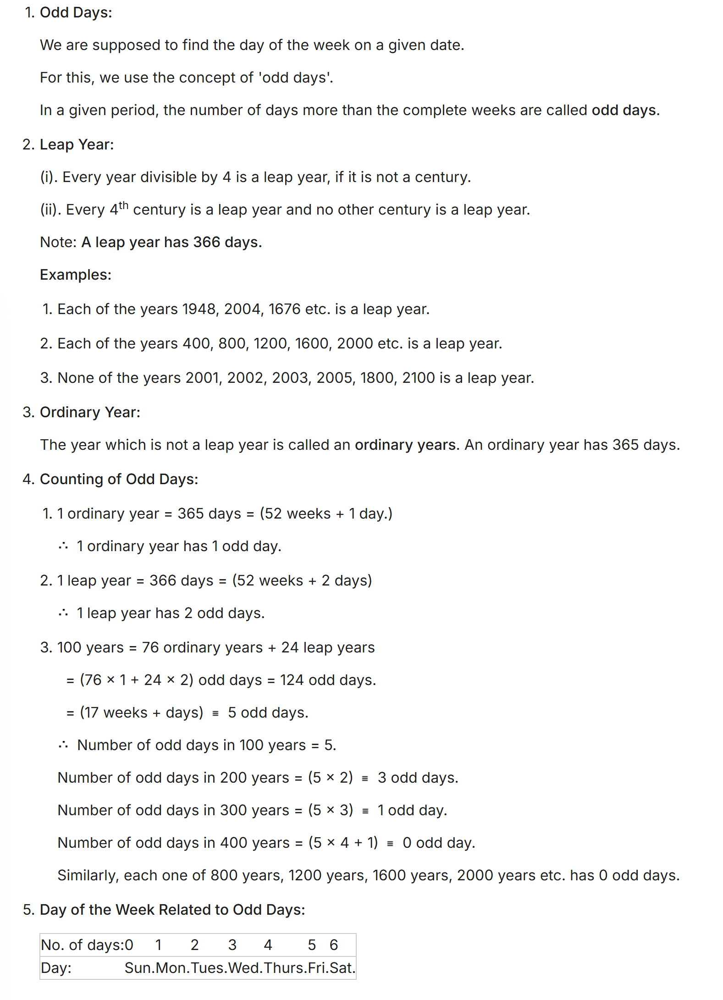

## Calendars

### Odd Days in Each Month (Non-Leap Year)

| Month      | Odd Days Till Each Month |
|------------|--------------------------|
| January    |   3                      |
| February   |   3                      |
| March      |   6                      |
| April      |   1                      |
| May        |   4                      |
| June       |   6                      |
| July       |   2                      |
| August     |   5                      |
| September  |   0                      |
| October    |   3                      |
| November   |   5                      |
| December   |   1                      |

> **Note:** The number of odd days is calculated as the remainder when the total number of days up to that month is divided by 7.

### Leap Year Calendar Repetition

- The calendar for a leap year repeats after **28 years**.
- For a non-leap year, the calendar repeats after **6 years**.
- The calendar for the 2nd and 3rd years after a leap year repeats after **11 years**.
- After this cycle, the leap year pattern starts again.

> **Tip:** This repetition is due to the way odd days accumulate over years and the leap year cycle in the Gregorian calendar.