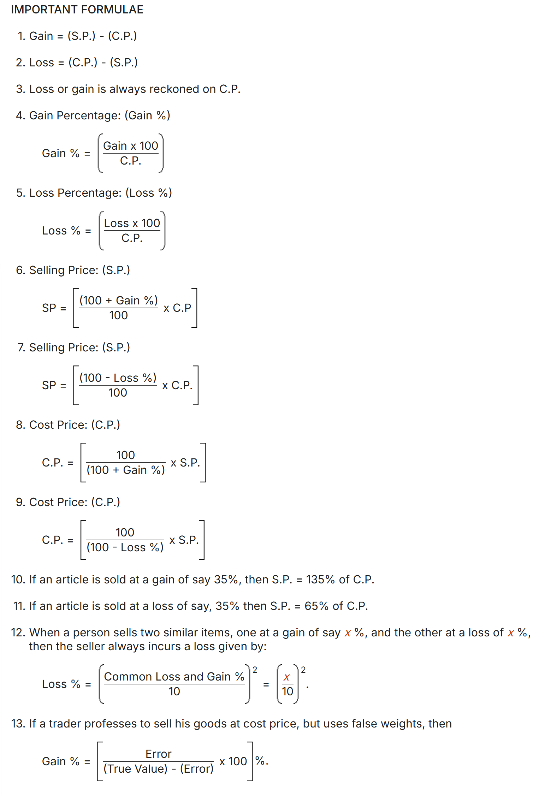

## Profit and Loss

### Marked Price

The **Marked Price (MP)** is the price that is printed or labeled on an article, before any discount is applied. It is also known as the list price.

**Example:**  
If a shirt has a marked price of ₹500, this is the price shown to customers before any discount.

---

### Discount

A **Discount** is a reduction given on the marked price of an article. It is usually offered to attract customers.

- **Discount Amount** = Marked Price − Selling Price
- **Discount Percentage** = (Discount Amount / Marked Price) × 100
- **Selling Price** = Marked Price − Discount Amount
- **Selling Price** = Cost Price + Profit
- **Selling Price** = Cost Price − Loss

**Example:**  
If the marked price of a book is ₹200 and it is sold at a discount of 10%,  
Discount Amount = ₹200 × 10% = ₹20  
Selling Price = ₹200 − ₹20 = ₹180

--- 