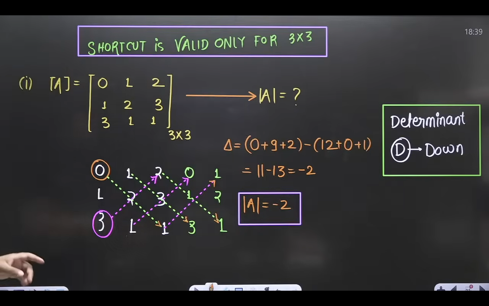

## Linear Algebra

### Determinants and Matrix

- minus(-), plus(+) goes alternately.
- Maximum Number of terms after expansion = n!
- Determinant of Diagonal Matrix, Upper and Lower Triangle Matrix = a1.b2.c3

