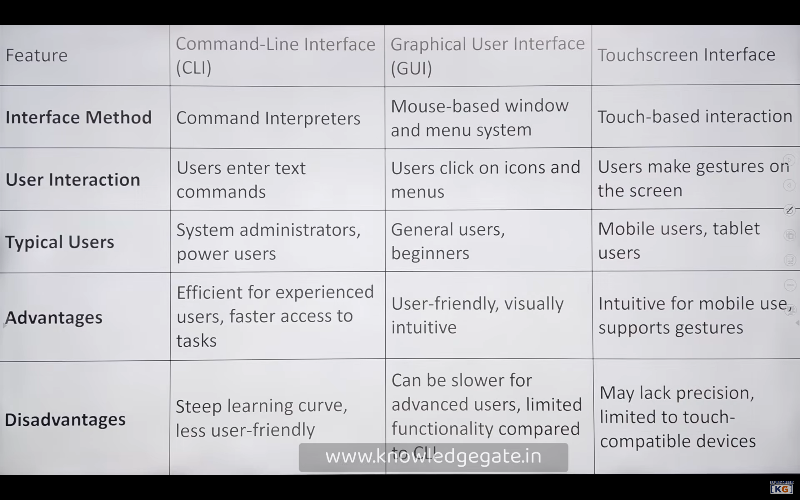

## Interface and System Calls to OS

### [Interfaces]()

### [System Calls]() 

- System calls provide the `interface` between a process and the operating system.
- They allow user-level processes to request services from the kernel, such as file operations, process management, and communication.
- Common system calls include `open()`, `read()`, `write()`, `fork()`, and `exec()`.

  #### [Mode Bit]() 
  - The mode bit is a flag used by the operating system to distinguish between user mode and kernel mode.
  - [User Mode : Mode Bit =1]() : When a process is executing in user mode, it has limited access to system resources and cannot directly execute privileged instructions.
  - [Kernel Mode : Mode Bit = 0]() : When a process makes a system call, the mode bit is switched to kernel mode, allowing the process to access protected resources and execute privileged instructions.