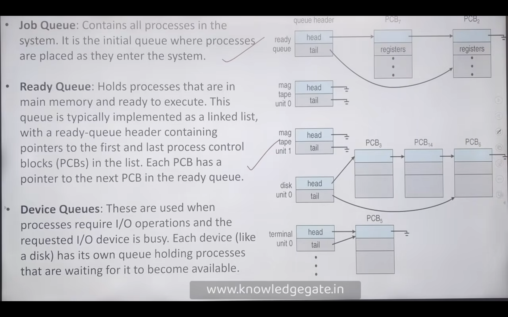
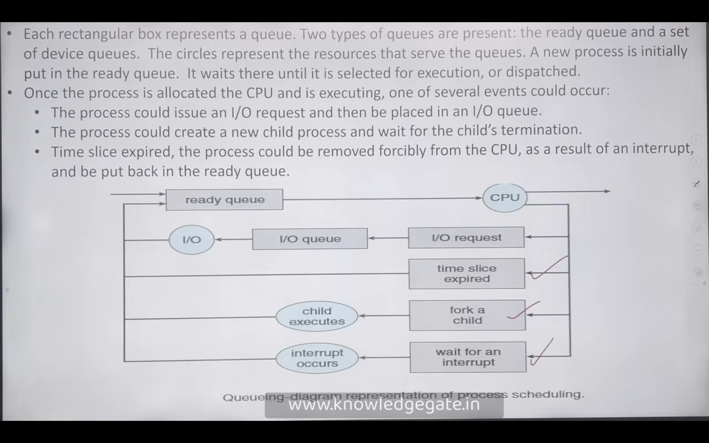
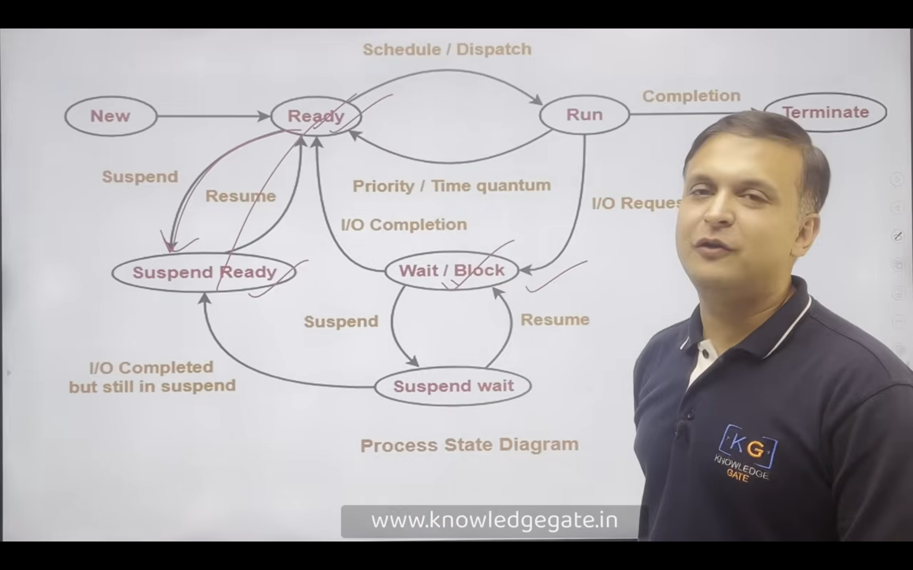

## Queues, Scheduler, and Context Switch

---

### Queues

Queues are fundamental data structures used by operating systems to manage processes at various stages. Common queues include:

- **Job Queue**: Holds all processes in the system.
- **Ready Queue**: Contains processes that are loaded in main memory and ready to execute.
- **Device Queue**: Holds processes waiting for a particular I/O device.

---

### Scheduler

Schedulers are special system software components that select processes for execution at different stages.

#### **Long-Term Scheduler (LTS)**
- Also called the **job scheduler**.
- Selects processes from the job pool (secondary memory) and loads them into main memory.
- Moves processes from the **new** state to the **ready** state.

#### **Short-Term Scheduler (STS)**
- Also called the **CPU scheduler**.
- Selects from processes in the ready queue and allocates the CPU.
- Invoked very frequently (milliseconds).
- Handles context switching between processes.
- Moves processes from the **ready** state to the **running** state.

#### **Medium-Term Scheduler (MTS)**
- Also called the **swapper**.
- Temporarily removes processes from main memory and places them in secondary memory (disk).
- Used to manage memory contention.
- Moves processes from the **running** state to the **suspended** state.

---

### Dispatcher & Context Switch

- The **dispatcher** is a module that gives control of the CPU to the process selected by the short-term scheduler.
- **Context switch** is the process of saving the state of a currently running process and loading the state of the next process to run.
- Context switching enables multitasking by allowing multiple processes to share the CPU efficiently.

---