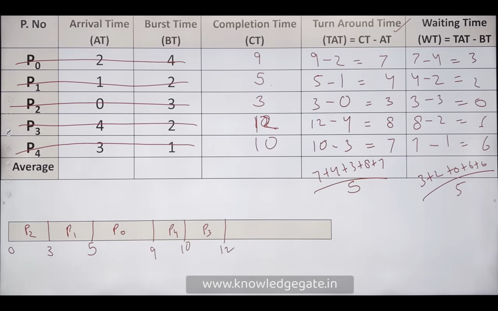
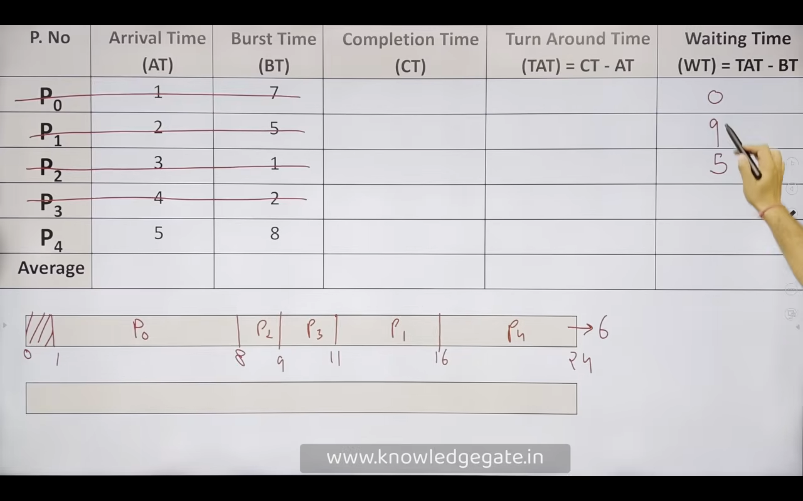
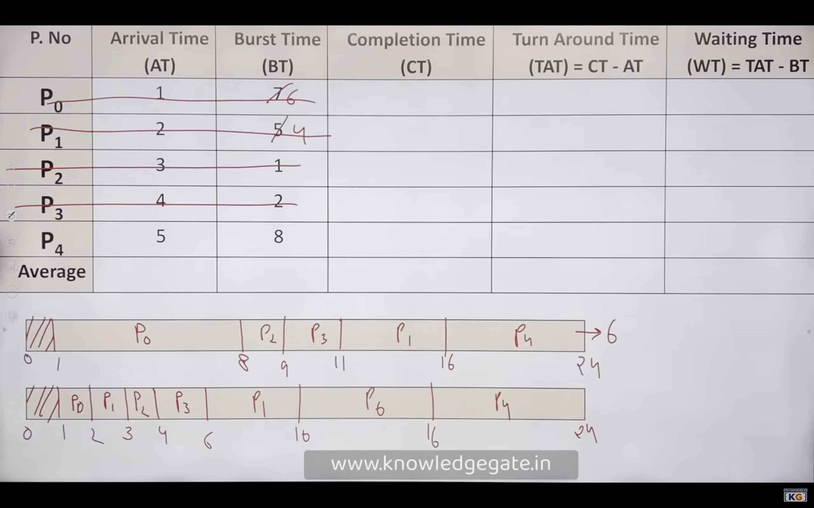
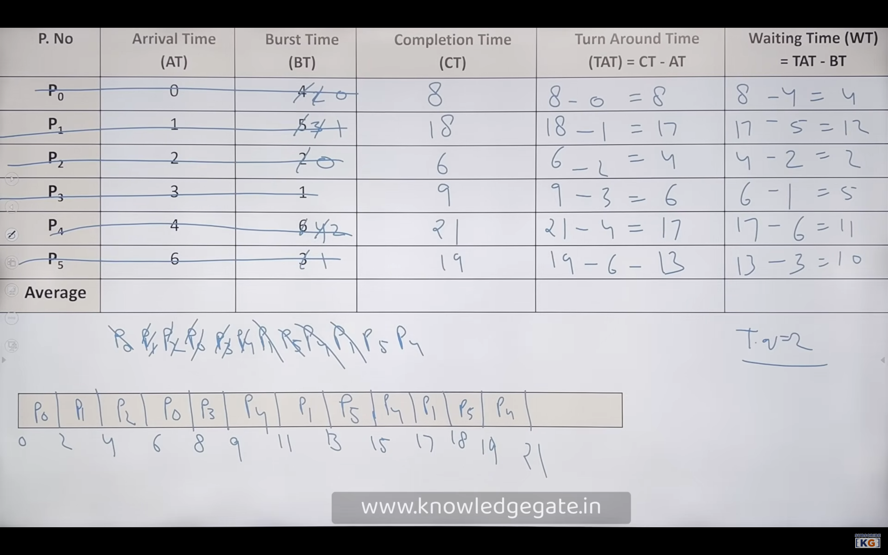

## CPU Scheduling Algorithm

CPU scheduling decides which process gets the CPU next. Good scheduling improves CPU use and system response.

### [Types](#) 

#### [Non-Preemptive:](#)  
- Process runs till it finishes or blocks.  
- No interruption by other processes.  
- Examples: First-Come, First-Served (FCFS), Shortest Job First (SJF).

#### [Preemptive:](#)  
- OS can switch processes anytime.  
- Higher-priority process can preempt.  
- Examples: Round Robin (RR), Shortest Remaining Time First (SRTF), Preemptive Priority Scheduling.

#### [Summary:](#)
- Preemptive: better for interactive systems.  
- Non-preemptive: simpler, but can delay short/high-priority jobs.

#### [Common Algorithms:](#)

#### [First Come First Serve (FCFS)](#)
- Processes are scheduled in the order they arrive.
- Non-preemptive: once a process is running, it cannot be stopped until it finishes.

 

#### [Shortest Job First (SJF) - Non-Preemptive](#)
- Processes are scheduled based on the length of their next CPU burst.
- Non-preemptive: once a process is running, it cannot be stopped until it finishes.

#### [Shortest Remaining Time First (SRTF)- Preemptive](#)
- Processes are scheduled based on the length of their remaining CPU burst.
- Preemptive: if a new process arrives with a shorter remaining time, it can preempt the currently running process.

#### [Round Robin (RR) - Preemptive](#)
- Each process is assigned a fixed time slice (quantum).
- If a process doesn't finish within its time slice, it is preempted and placed at the end of the queue.

