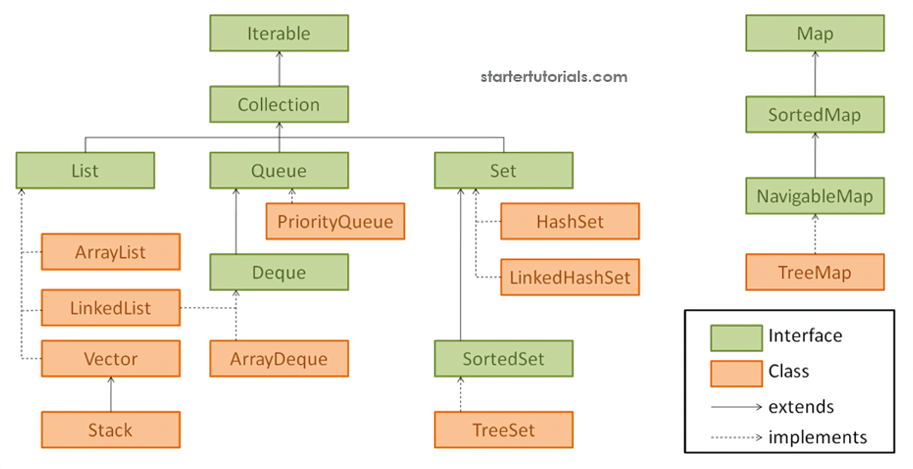

# Collections

#### [Iterable Interface](/collections/IterableInterface/readme.md)

#### [Collection Interface](/collections/collection/readme.md)

#### [List Interface](/collections/list/readme.md)

#### [Queue Interface](/collections/queue/readme.md)

#### [Set Interface](/collections/Set/readme.md)

#### [Map Interface](/collections/Map/readme.md)
