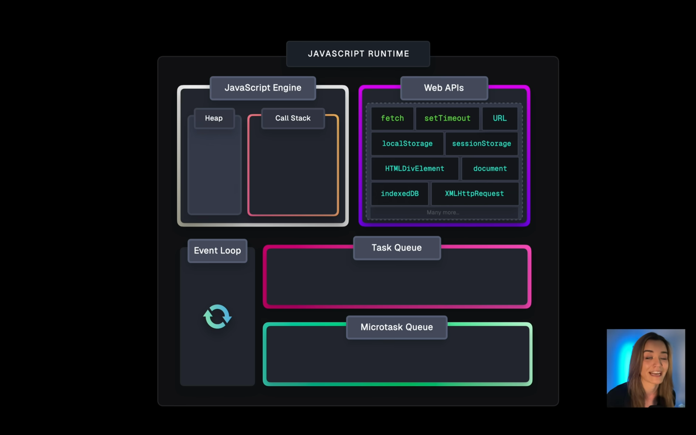

# JavaScript Runtime

JavaScript is synchronous single-threaded language.

## It is made up of mainly:
- Heap
- Call Stack
- Event Loop
- Microtask Queue
- Web API
- Task Queue

### Heap
- A memory allocation area where objects and variables are stored.

### Call Stack
- It manages the execution of program.
- It uses LIFO (Last In First Out) principle.
- It keeps track of the function calls.
- It is synchronous.
- It is single-threaded.
- It is a data structure that records the function calls.

### Web API
- It is a set of functions and objects that are provided by the browser.
- It is used to interact with the browser.
- It is asynchronous.
- It is multi-threaded.
- It is non-blocking.
- It is used to handle the tasks that are not handled by the JavaScript Engine (Heap and callstack).
- It is used to handle the tasks that are handled by the browser.
- e.g. setTimeout, setInterval, fetch, DOM etc.

### Task Queue
- It is a queue used to hold the tasks that are completed by the Web API.
- Callbacks based api's are handled by the Task Queue.
- It is used to hold the tasks that are ready to be executed by the call stack after the call stack is empty.

### Microtask Queue
- It is a queue used to hold the tasks that are ready to be executed by the call stack after the call stack is empty.
- Promise based api's are handled by the Microtask Queue.
- It has higher priority than the Task Queue.

### Event Loop
- It is a loop that continuously checks the call stack and the task queue.
- It checks if the call stack is empty or not.
- If the call stack is empty, it checks the task queue.
- If there are tasks in the task queue, it moves the tasks to the call stack.

